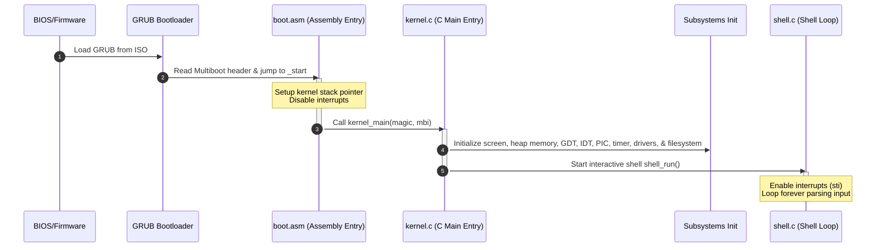

# MiniOS System Architecture

This document describes the design, subsystems, and boot execution flow of **MiniOS**, a minimal 32-bit x86 operating system.

---

## 1. System Overview & Layers

MiniOS operates entirely in **32-bit Protected Mode** on x86 architectures. It utilizes a monolithic kernel style, where all drivers, memory management, and filesystem services reside in the kernel space.

```text
┌───────────────────────────────────────────┐
│              User applications            │
│            (Command-Line Shell)           │
├───────────────────────────────────────────┤
│            System Services Layer          │
│        (MiniEdit, File Manager, Todo)     │
├───────────────────────────────────────────┤
│                 MiniFS                    │
│      (Hierarchical In-Memory Filesystem)  │
├───────────────────────────────────────────┤
│         Memory & Heap Management          │
│       (Block-List Allocator / malloc)     │
├───────────────────────────────────────────┤
│              Hardware Drivers             │
│    (VGA Screen, Keyboard, Mouse, Timer)   │
├───────────────────────────────────────────┤
│          Descriptor Tables (GDT/IDT)      │
│          and PIC IRQ Interrupt Controller │
├───────────────────────────────────────────┤
│         Multiboot Kernel (boot.asm)       │
└───────────────────────────────────────────┘
```

---

## 2. Boot Flow Sequence

The startup sequence progresses from bare metal (or emulator reset) to the command-line shell:



1. **BIOS / GRUB**: The BIOS boots the system, finds the GRUB bootloader on the CD-ROM ISO. GRUB checks the Multiboot signatures inside our kernel binary, loads the executable segments into RAM at `1 MiB`, and jumps to the entry point `_start` in `boot.asm`.
2. **`boot/boot.asm`**: 
   - Defines the Multiboot header fields (magic, flags, checksum).
   - Establishes a 16 KiB stack area in the `.bss` section.
   - Sets the stack pointer `esp` and disables interrupts (`cli`).
   - Jumps to the C-entry point `kernel_main`.
3. **`kernel/kernel.c`**: Initializes terminal output first, prints the splash screen, and proceeds to install memory managers, descriptor tables, interrupt controllers, and hardware drivers in sequence.
4. **Shell Execution**: Triggers the interactive shell, enabling CPU interrupts (`sti`) to accept hardware keyboard and mouse input.

---

## 3. Core Kernel Subsystems

### 3.1. Descriptor Tables & Interrupts
- **Global Descriptor Table (GDT)** ([gdt.c](file:///Users/apple/Documents/Ecotrustia-data/Own-projects-planning/mini-os/MiniOS/kernel/gdt.c)): Sets up three segment descriptors using a flat memory layout model where segments span the entire 4 GiB address space:
  - **Null Descriptor** (Selector `0x00`)
  - **Kernel Code Segment** (Selector `0x08`, base `0`, limit `0xFFFFFFFF`, Ring 0, Read/Execute)
  - **Kernel Data Segment** (Selector `0x10`, base `0`, limit `0xFFFFFFFF`, Ring 0, Read/Write)
- **Interrupt Descriptor Table (IDT)** ([idt.c](file:///Users/apple/Documents/Ecotrustia-data/Own-projects-planning/mini-os/MiniOS/kernel/idt.c)): Contains 256 interrupt gates. It registers stubs for 32 processor exceptions (vectors `0-31`) and 16 hardware interrupts (vectors `32-47`).
- **Programmable Interrupt Controller (PIC)** ([pic.c](file:///Users/apple/Documents/Ecotrustia-data/Own-projects-planning/mini-os/MiniOS/kernel/pic.c)): Remaps the dual 8259A PIC chips. By default, IBM-compatible PCs map hardware interrupts IRQ 0-7 to CPU vectors 8-15 (conflicting with CPU exceptions like Double Faults). MiniOS remaps IRQ 0-7 to vector numbers 32-39 and IRQ 8-15 to vector numbers 40-47.

---

## 4. Memory Management

MiniOS implements a **Block-List Heap Allocator** inside [memory.c](file:///Users/apple/Documents/Ecotrustia-data/Own-projects-planning/mini-os/MiniOS/kernel/memory.c).

```text
Heap Region: Defined in linker.ld (immediately following the kernel binary)
Heap Size  : 256 KiB (262,144 bytes)

Block Header Structure:
┌─────────────────┬─────────────────┬─────────────────────────┐
│ size_t size     │ int is_free     │ struct block *next      │
└─────────────────┴─────────────────┴─────────────────────────┘
```

- **Initialization**: Carves out a fixed `256 KiB` heap buffer. The entire buffer starts as a single block marked as `is_free = 1`.
- **`kmalloc(size)`**: Walks the linked list of blocks. It looks for the first block where `is_free == 1` and `size >= requested_size` (First-Fit). If the block size exceeds the request + header size, the block is split into two, leaving the remainder free.
- **`kfree(ptr)`**: Locates the header corresponding to the pointer, marks the block `is_free = 1`, and walks the list to coalesce adjacent free blocks to prevent memory fragmentation.

---

## 5. Hardware Drivers

### 5.1. VGA Screen Driver
- Maps directly to the memory-mapped physical text buffer at address `0xB8000`.
- The screen resolution is standard **80 columns × 25 rows**.
- Each character cell occupies 2 bytes:
  - Byte 0: ASCII character value.
  - Byte 1: Attribute byte containing foreground and background colors (4 bits each).
- Auto-scrolls the screen by shifting rows upwards using `memcpy` when the cursor reaches the 25th row.

### 5.2. PS/2 Keyboard Driver
- Operates on hardware line **IRQ1** (vector 33).
- Uses standard US QWERTY Scan Code Set 1 mapping.
- Intercepts key-down and key-up events, updating Shift/CapsLock state, and stores characters in a ring buffer.
- Features command-history scanning inside shell prompts via Up/Down arrow keys.

### 5.3. PS/2 Mouse Driver
- Operates on hardware line **IRQ12** (vector 44) through the secondary PS/2 controller port.
- Initializes the mouse by sending configuration command bytes through port `0x64` and `0x60`.
- Extends the mouse to **IntelliMouse** 4-byte scroll wheel mode.
- Intercepts scroll-wheel movements to trigger scrollback features on the console.

### 5.4. Programmable Interval Timer (PIT)
- Fired by the system clock on hardware line **IRQ0** (vector 32).
- Configured to fire at a frequency of **100 Hz** (100 times per second).
- Increments a global uptime tick counter used for CPU delays (`timer_wait`), pseudo-random number seeding (`rand`), and uptime dashboard displays.

---

## 6. MiniFS (In-Memory Filesystem)

MiniFS is an custom, hierarchical in-memory filesystem implemented in [filesystem.c](file:///Users/apple/Documents/Ecotrustia-data/Own-projects-planning/mini-os/MiniOS/kernel/filesystem.c).

- **Structure**: 
  - Supports up to **32 file/directory slots**.
  - Pathnames are stored as absolute paths (e.g. `/root/notes.txt`).
  - Max filename length: **64 bytes**.
  - Max file capacity: **256 bytes** of raw text data.
- **Directories**: Directories are special slots marked with `is_dir = 1`. Paths are resolved relative to a global state variable `current_dir` maintained by the shell.
- **Persistence**: Because the files are stored in a static array in the kernel's RAM memory, all filesystem states are volatile and reset upon system reboot.
